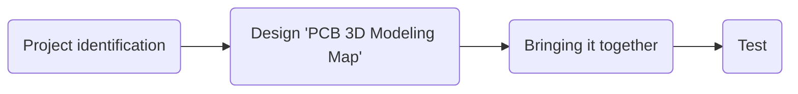

# hirob-em-pcbdesign

# Welcome to hirob-em-pcbdesign!

  Hello there!
# Our goals

 **To bring the project to a good end with the harmony within the team and to learn **

# Step By Step
- >specific determination of the required components
- >Making 'PCB Design' of the circuit diagram
- >collection of the design on the circuit

